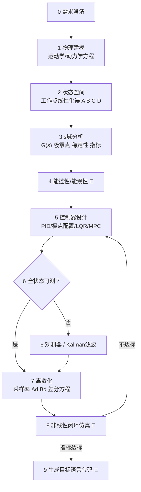
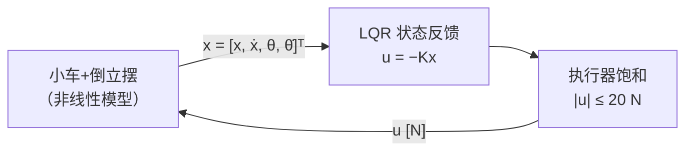
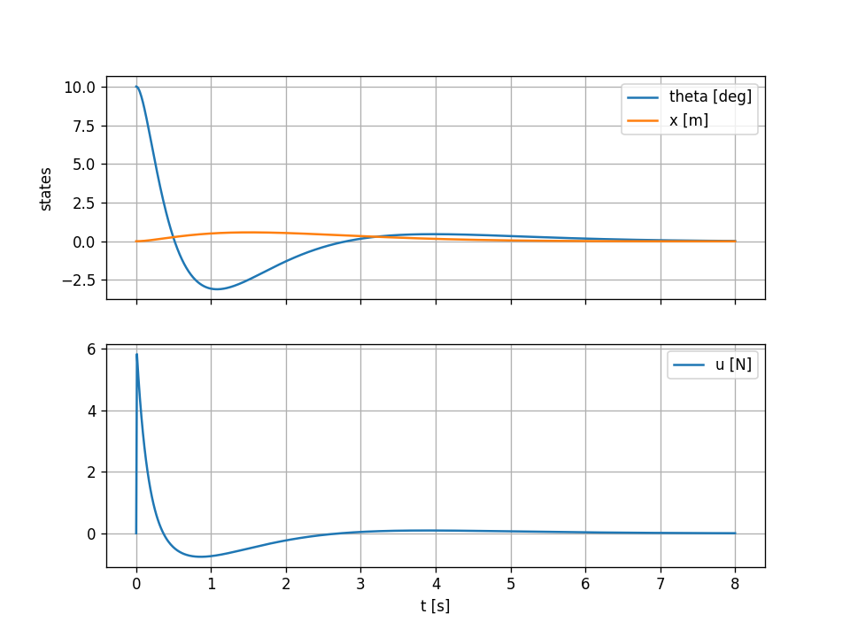

# control-system-design

运动学/动力学建模与控制系统全流程设计的 Agent Skill：从一句物理对象的自然语言描述出发，完成建模 → 状态空间 → s域分析 → 能控性/能观性判定 → 控制器设计 → 离散化 → 非线性闭环仿真验证 → 可部署代码生成，输出完整设计报告与可编译运行的控制器源码。

> 设计哲学：每一步的结论都由上一步推导得出，所有数值必须真实计算，所有框图用 mermaid 画出，三个硬门槛不通过就禁止进入下一阶段。

## 九阶段流水线



**三个硬门槛（🚧）**：

1. **能控性门槛**：不能稳的系统判定为物理不可行（需改变执行器位置/增加执行器），禁止硬设计；
2. **仿真门槛**：控制器必须在 Stage 1 的非线性原模型上闭环仿真达标（超调/调节时间/控制量峰值），不达标打回重新设计——禁止凭"看起来合理"编造指标数字；
3. **对拍门槛**：生成的目标语言代码必须与 Python 仿真在同一输入序列下逐拍比对通过（double 容差 1e-9、float 容差 1e-5 相对误差）。

## 支持的控制器方法

| 方法 | 适用场景 | 备注 |
|---|---|---|
| PID | SISO、低阶、输出反馈 | Z-N/极点配置/频域三种整定，抗积分饱和、微分滤波 |
| 极点配置 | 全状态可测、指标明确 | Ackermann 公式，Butterworth 极点模板 |
| LQR / DLQR | MIMO、要求最优折中 | Bryson 法则定 Q/R，CARE/DARE 数值求解 |
| LQG | 输出不可全测 | LQR + Kalman，分离原理 |
| MPC | 有约束、大滞后、需预见 | Δu 增广模型、QP/无约束解析解、终端代价 |
| Luenberger 观测器 / Kalman 滤波 | 状态估计 | 对偶系统配极点 / 稳态增益离线化 |
| 进阶：增益调度、反馈线性化、滑模、输入整形、ADRC | 非线性/特殊场景 | 附速查做法 |

跟踪参考一律实现无静差（积分器增广或前馈），采样率先论证再取值（≥20× 闭环带宽）。

## 安装

```bash
# 放入 agent 工具的 skills 目录即可被自动发现
# （跨工具标准路径 ~/.agents/skills/ 为用户级；<项目>/.agents/skills/ 为项目级）
git clone git@github.com:xingxingRealzyx/control-system-design.git ~/.agents/skills/control-system-design

# 脚本依赖（scipy 可选，缺失时自动回退纯 numpy 实现）
pip3 install --user numpy scipy
```

## 使用方式

在 agent 对话中直接描述对象和控制需求即可自动触发，例如：

- "帮我做一个弹簧质量阻尼系统的 PID 位置控制，m=1kg，k=100N/m，c=2N·s/m，超调<5%，调节时间<2s"
- "用 LQR 控制一级倒立摆，M=1.2kg，m=0.12kg，l=0.4m，从 5 度初始偏角镇定，生成 C 代码给 STM32 用"
- "直流电机速度环，J=0.01，b=0.1，Kt=Ke=0.05，R=1，L=0.5，转速传感器有噪声，对比 PID 和 LQR"
- "四旋翼高度环 MPC 控制，带推力上下限约束，输出 python"

输出语言不指定时**默认 C**（C99、无动态内存、参数/状态分离、init+update 接口、限幅与 NaN 防护）。

## 端到端示例：小车倒立摆 LQR 镇定

以下为仓库自带演示的完整产出（`M=1.0kg, m=0.1kg, l=0.5m`，初始偏角 10°），全流程自动生成。

**① 状态空间**（拉格朗日建模 → 顶点线性化，`D=(M+m)(I+ml²)−m²l²`）：

$$
\dot x = Ax + Bu,\quad
x=\begin{bmatrix} x \\ \dot x \\ \theta \\ \dot\theta \end{bmatrix},\quad
A=\begin{bmatrix}
0 & 1 & 0 & 0 \\
0 & 0 & -0.7178 & 0.9756 \\
0 & 0 & 0 & 1 \\
0 & 0 & 15.7917 & 0
\end{bmatrix},\quad
B=\begin{bmatrix} 0 \\ 0.9756 \\ 0 \\ -1.4634 \end{bmatrix}
$$

**② 能控性/能观性**：能控性矩阵秩 4/4，能观性矩阵秩 4/4，完全能控能观——LQR 与观测器均可行。开环极点 `+3.97, 0, 0, −3.97`（倒立点不稳定）。

**③ 控制器**（Bryson 初值 + 手动加权摆角，CARE 数值解）：

$$
Q=\mathrm{diag}(1,\ 1,\ 100,\ 10),\quad R=1\quad\Rightarrow\quad
K=\begin{bmatrix} -1.00 & -2.37 & -33.38 & -9.21 \end{bmatrix}
$$



**④ 非线性闭环仿真**（RK4 对象 + Ts=10ms 离散控制器，从 10° 初始偏角自由释放）：



| 指标 | 结果 |
|---|---|
| 摆角终值 | 0.017°（初值 10°） |
| 调节时间（2%） | 5.65 s（与最慢闭环模态 −0.67 一致） |
| 超调（调节过程） | 31.4%（摆杆下冲 −3.4°） |
| 控制量峰值 | 5.83 N（限幅 ±20 N，未触饱和） |
| 闭环极点 | −6.51, −3.33, −0.67±0.47j（全部左半平面） |

**复现**：

```bash
python3 scripts/linhelper.py demo            # 建模→能控能观→LQR→极点配置→离散化
python3 scripts/closedloop_sim_template.py   # 非线性闭环仿真 → 曲线与指标
```

## 输出物

每次运行产出一份十章结构的设计报告：

`问题定义 → 物理建模(含参数表与来源标注) → 状态空间 → s域分析 → 能控能观 → 控制器设计 → 离散化 → 仿真验证(指标对比表) → 目标语言代码(含对拍结果) → 假设与局限回顾`

关键中间结果全程配 mermaid 框图：坐标定义图、开环信号流图、闭环控制结构图、离散实现框图（ADC/差分方程/PWM 保持）。未给定的物理参数查典型值并在参数表标注"假设"，最后集中回顾提醒替换。

## 仓库结构

```
control-system-design/
├── SKILL.md                          # 主文件：九阶段流水线、门槛、报告模板、符号规范
├── references/
│   ├── modeling.md                   # 建模方法、拉格朗日五步法、线性化、3 个完整算例
│   ├── analysis.md                   # 传递函数、Routh、时频域公式、能控能观判据、Kalman 分解
│   ├── controllers.md                # PID/Ackermann/LQR/Kalman/MPC 公式与整定、进阶方法
│   ├── discretization.md             # 采样率、ZOH/Tustin、矩阵指数、差分方程、常见坑
│   └── codegen.md                    # C 代码规范与参考实现、定点化、对拍协议
└── scripts/
    ├── linhelper.py                  # 分析工具（见下）
    └── closedloop_sim_template.py    # 闭环仿真骨架（见下）
```

## 脚本工具

**linhelper.py** — 控制系统分析工具，仅依赖 numpy（装 scipy 自动加速）：

| 函数 | 功能 |
|---|---|
| `rank_report(A,B,C)` | 极点 + 能控能观秩 + PBH 坏模态定位 + 能稳/能检结论，一键输出 |
| `lqr / dlqr` | 连续/离散 Riccati 方程（scipy 或 Kleinman 迭代/值迭代回退） |
| `place(A,B,poles)` | Ackermann 极点配置（SISO） |
| `c2d(A,B,Ts)` | ZOH 精确离散化（增广矩阵指数） |
| `freq_margins` | 频域增益/相位裕度扫描 |
| `step_metrics` | 阶跃响应指标（超调/调节时间/上升时间） |
| `expm` | 纯 numpy 矩阵指数（scaling-and-squaring） |

```bash
python3 scripts/linhelper.py demo   # 小车倒立摆端到端演示（已验证）
```

**closedloop_sim_template.py** — Stage 8 标准仿真骨架：RK4 积分非线性被控对象 + 固定 Ts 调用离散控制器（ZOH），输出指标统计表与对拍 CSV，换三处标记即可复用到新对象。

## 适用对象示例

倒立摆（一级/二级/旋转）、四旋翼/无人机、直流/永磁同步电机、机械臂（D-H）、小车系统、弹簧-质量-阻尼、球杆系统、龙门吊防摆、火箭/船舶航向（Nomoto）等。对象拓扑由 AI 从描述中自行建模，参数缺失时使用文献典型值并明确标注。

## 环境要求

- Python 3.9+，numpy（必需），scipy（可选，加速 ARE 求解与 expm），matplotlib（可选，画仿真曲线）
- 生成 C 代码仅需任意 C99 编译器；对拍 harness 使用 scanf/printf，无其他依赖
