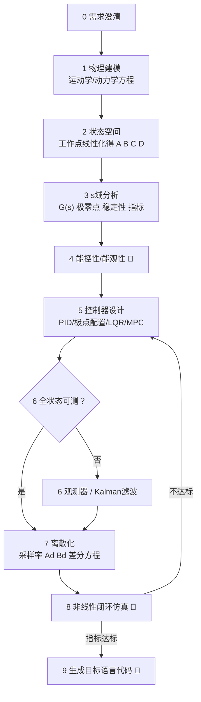
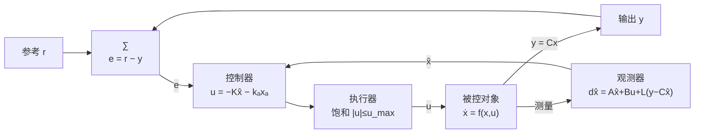

# 控制系统建模 · 分析 · 设计 · 代码生成

从运动学/动力学方程出发，到可部署控制器代码的完整流水线。核心原则：**每一步的结论都由上一步推导得出，所有数值必须真实计算，所有框图用 mermaid 画出。**

## 九阶段流水线

必须按序执行。带 🚧 的是硬门槛，未通过禁止进入下一阶段。



## Stage 0 — 需求澄清

开始前明确以下信息，用户未给的按备注列合理假设（后续在参数表中以"假设"标注）：

| 要素 | 内容 | 缺省处理 |
|---|---|---|
| 对象与自由度 | 几何、连接关系、运动平面 | 向用户确认，禁止臆造拓扑 |
| 参数 | 质量、长度、惯量、阻尼、电机常数等 | 查文献典型值，标注"假设" |
| 控制目标 | 镇定 / 调节 / 跟踪 / 抗扰 | 默认镇定+阶跃跟踪 |
| 性能指标 | 超调量、调节时间、带宽、稳态误差 | 默认 σ≤10%、ts 按 2% 准则 |
| 执行器约束 | 力/力矩饱和、速率限制 | 默认分析时给出所需峰值控制量并对照 |
| 测量 | 哪些状态可测、传感器噪声 | 默认全部状态可测（可测则跳过观测器） |
| 输出语言 | c / cpp / python / rust / js… | **默认 c** |
| 部署平台 | MCU / Linux / 仅仿真 | 默认嵌入式友好（float、无动态内存） |

## Stage 1 — 物理建模 → 读 `references/modeling.md`

- 建模路线选择（牛顿-欧拉 / 拉格朗日 / D-H / 能量法）与五步拉格朗日流程见该文件。
- 产出：①坐标系与变量定义（mermaid 图）；②非线性运动方程 M(q)q̈ + C(q,q̇)q̇ + G(q) = Bu；③参数表（符号/含义/数值/单位/来源：给定|假设）。
- 摩擦、死区等非线性项：线性模型中丢弃，但**写入非线性仿真模型**。
- 完整算例（弹簧质量阻尼、直流电机、小车倒立摆全过程推导）在同文件，遇同类对象直接对照。

## Stage 2 — 状态空间与线性化 → 读 `references/modeling.md` §线性化

- 状态取物理量：位置/角度 + 速度/角速度；写 ẋ = f(x,u)。
- 平衡点 (x₀, u₀)：解 f(x₀,u₀)=0（倒立摆类对象注意顶点是不稳定平衡点）。
- A = ∂f/∂x|₍x₀,u₀₎，B = ∂f/∂u|₍x₀,u₀₎，给出偏差量 δẋ = Aδx + Bδu 后去掉 δ 记号得 (A, B, C, D)。
- **非线性原模型保留**，Stage 8 仿真必须用它。

## Stage 3 — s域分析 → 读 `references/analysis.md`

- G(s) = C(sI−A)⁻¹B + D，展开为分子/分母多项式。
- 极点、零点 → 稳定性结论；主导极点 → 等效 ωₙ、ζ → 开环指标表（超调、调节时间估计）。
- 必要时补 Routh 判据与频域裕度（公式与数值算法在 analysis.md）。

## Stage 4 — 能控性 / 能观性 🚧 → 读 `references/analysis.md` §能控能观

- rank 𝒞 = rank[B AB … Aⁿ⁻¹B] = n（能控）；rank 𝒪 = n（能观）。用 `scripts/linhelper.py` 计算。
- **门槛结论必须三选一并写明**：
  1. 完全能控能观 → 任意配置极点，方案自由；
  2. 不完全但能稳/能检 → 用 PBH 找出不可控(不可观)模态，说明它们不影响镇定及理由；
  3. 不能稳 → **物理上该执行器无法控制该自由度**，告知用户需改变执行器位置/增加执行器，禁止硬设计。
- 结论决定 Stage 5 可行方案（能控⇔极点配置/LQR 可解；能观⇔观测器极点可任意配）。

## Stage 5 — 控制器设计 → 读 `references/controllers.md`

选型决策矩阵（详细版在 controllers.md）：

| 场景 | 首选 |
|---|---|
| SISO、低阶、只需输出反馈 | PID（含抗饱和、微分滤波） |
| 全状态可测、MIMO/多状态、要求系统化最优 | LQR + 积分增广/前馈跟踪参考 |
| 严格极点/超调指标 | 极点配置（Ackermann） |
| 全状态不可测 | LQR + Kalman（LQG）或极点配置 + 观测器 |
| 有输入/状态约束、大滞后、需预见参考 | MPC |

- 跟踪参考一律实现无静差：积分器增广（推荐）或前馈 N̄，公式在 controllers.md。
- **必画 mermaid 框图**：①开环对象框图（信号流向含物理含义）；②闭环控制结构框图（本方案完整结构：∑、控制器、执行器饱和、观测器）；③Stage 7 后补离散实现框图（ADC/采样/差分方程/PWM 保持）。模板：



## Stage 6 — 观测器 / Kalman（仅当全状态不可测）

Luenberger 观测器用对偶系统配极点；有噪声用离散 Kalman 滤波（完整方程在 controllers.md）。分离原理：控制与估计独立设计。观测器极点取控制极点的 3~5 倍快。

## Stage 7 — 离散化 → 读 `references/discretization.md`

- 采样率论证：ωs ≥ 20×闭环带宽（给出数字，不拍脑袋）。
- 对象：ZOH 精确离散 Ad = e^(AT)，Bd 用增广矩阵指数技巧一次算出。
- 控制器：PID → 位置式/增量式差分方程（含抗饱和伪码）；LQR/极点配置 → 增益不变逐拍执行 u[k] = −Kx̂[k]（需精确最优则换 DLQR）；MPC 天然离散。
- 校验：Ad 特征值全部在单位圆内。

## Stage 8 — 非线性闭环仿真 🚧

用 `scripts/closedloop_sim_template.py` 骨架（RK4 被控对象 + 固定 Ts 离散控制器）：

- **必须用 Stage 1 的非线性模型**，控制器用 Stage 7 离散差分方程逐拍运行。
- 数值计算用 `python3 scripts/linhelper.py` 与仿真脚本真实运行得出；**禁止凭直觉填写指标数字**。
- 产出指标对比表：指标 | 要求 | 仿真实测 | 结论；同时报告控制量峰值是否触饱和。
- 不达标 → 回 Stage 5 调 Q/R/极点/PID 参数重设计，直至达标。

## Stage 9 — 代码生成 🚧 → 读 `references/codegen.md`

- 语言：用户指定，**默认 C**（C99、无 malloc、参数与状态封装进 struct、含 init/update 接口、限幅与 NaN 防护、单位注释）。
- PID / 状态反馈+观测器参考实现在 codegen.md，可直接改造。
- **对拍门槛**：同一输入序列下，目标语言输出与 Python 仿真的偏差在容差内（float 1e-5 相对误差、double 1e-9），把对比结果写进报告。
- 代码文件写到用户工作目录，报告中给出文件路径与调用示例。

## 报告输出模板（严格遵循，保证过程清晰可追溯）

```markdown
# <对象> 控制系统设计报告
## 0. 问题定义
控制目标 / 性能指标 / 约束 / 输出语言
## 1. 物理建模
简化假设 → 坐标系与变量定义(mermaid) → 运动学 → 动力学推导 → 参数表(含来源标注)
## 2. 状态空间模型
状态选择 → 平衡点 → 线性化 → (A,B,C,D)
## 3. s域分析
G(s) → 极零点 → 稳定性 → 时/频域指标
## 4. 能控性与能观性
秩检验过程 → 结论与影响
## 5. 控制器设计
选型依据 → 设计过程(含公式代入数值) → 闭环框图(mermaid)
## 6. 观测器设计（若需要）
## 7. 离散化
采样率论证 → Ad,Bd → 控制器差分方程 → 离散实现框图(mermaid)
## 8. 仿真验证
仿真设置 → 指标对比表 → 控制量峰值 → 结论
## 9. 目标语言实现
文件路径 → 接口说明 → 对拍结果 → 使用示例
## 10. 假设与局限回顾
```

## 数学与符号规范

- 矩阵/公式用 LaTeX（`$$` 块），行内用 `$…$`；矩阵必须显式写出全部数值元素，不允许只给符号式。
- 统一记号：状态 $x$、输入 $u$、输出 $y$、参考 $r$、误差 $e$；连续 (A,B,C,D)，离散 (Ad,Bd,Cd,Dd)；K 状态反馈增益、L 观测器增益、Kf Kalman增益、Ts 采样周期、Q/R 权重、Qₙ/Rₙ 噪声协方差。全程不换符号名。
- 单位 SI，每个参数带单位。

## 参考文件索引

| 文件 | 内容 | 何时读 |
|---|---|---|
| `references/modeling.md` | 建模方法、拉格朗日五步法、线性化、3 个完整算例 | Stage 1–2 |
| `references/analysis.md` | 传递函数、标准型、Routh、时频域公式、能控能观判据、Kalman 分解 | Stage 3–4 |
| `references/controllers.md` | PID 整定/抗饱和、Ackermann、LQR/DLQR、Kalman、MPC、增广跟踪、进阶方法 | Stage 5–6 |
| `references/discretization.md` | 采样率、ZOH/Tustin/欧拉、矩阵指数算法、差分方程、常见坑 | Stage 7 |
| `references/codegen.md` | C/其他语言代码规范与参考实现、定点化、对拍协议 | Stage 9 |
| `scripts/linhelper.py` | 能控能观秩、PBH、LQR/DLQR、c2d、极点、阶跃指标（numpy，scipy 可选） | Stage 2–8 直接运行 |
| `scripts/closedloop_sim_template.py` | RK4 + 离散控制器闭环仿真骨架 + 指标统计 | Stage 8 复制改造 |

运行环境：脚本依赖 numpy（scipy 可选加速）。缺失时先 `pip3 install --user numpy scipy`。
